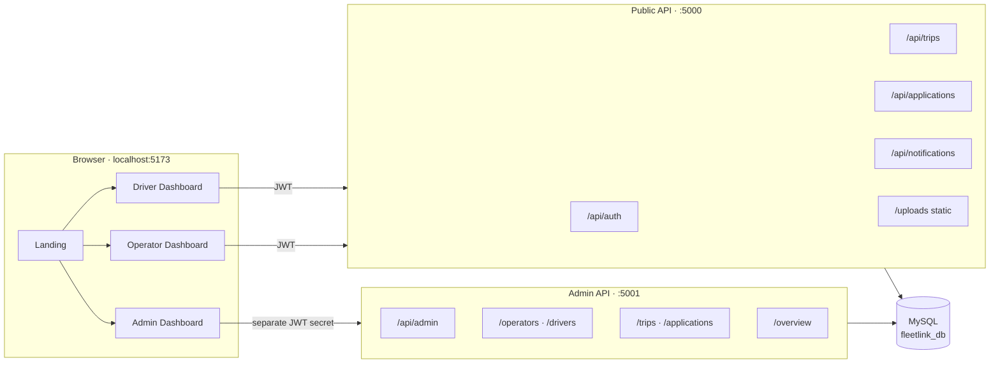
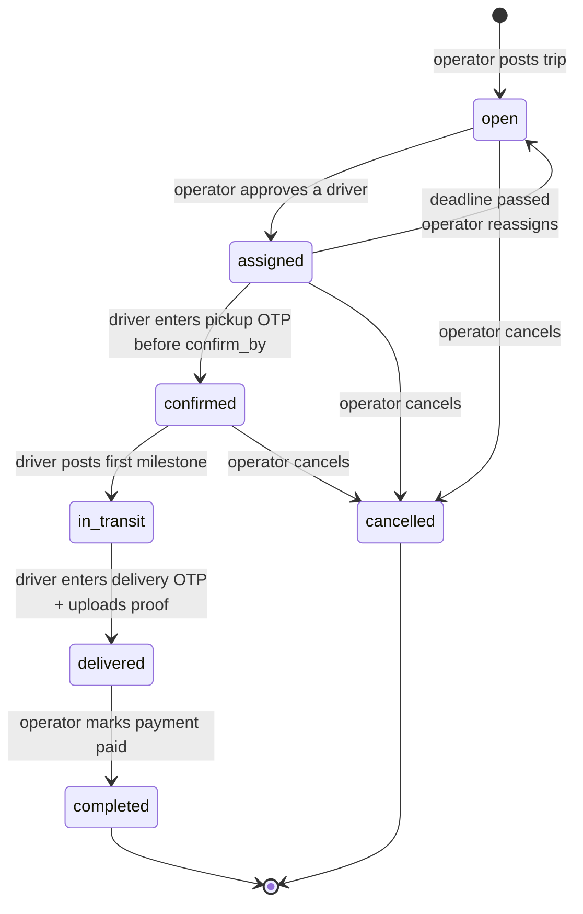
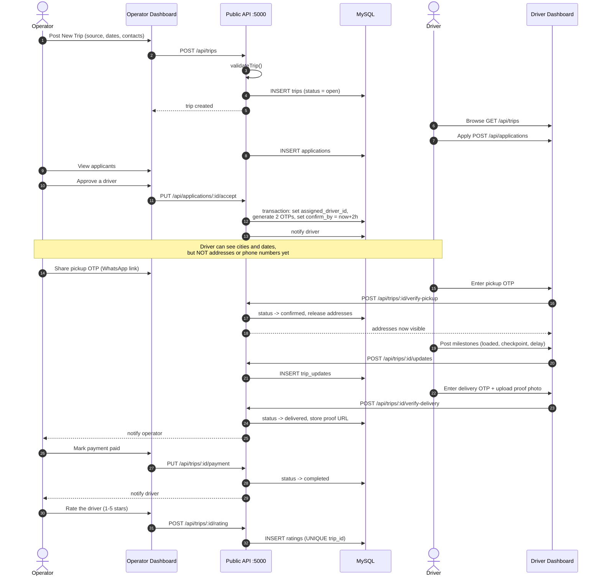
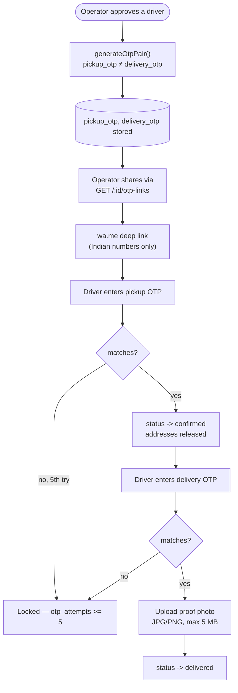
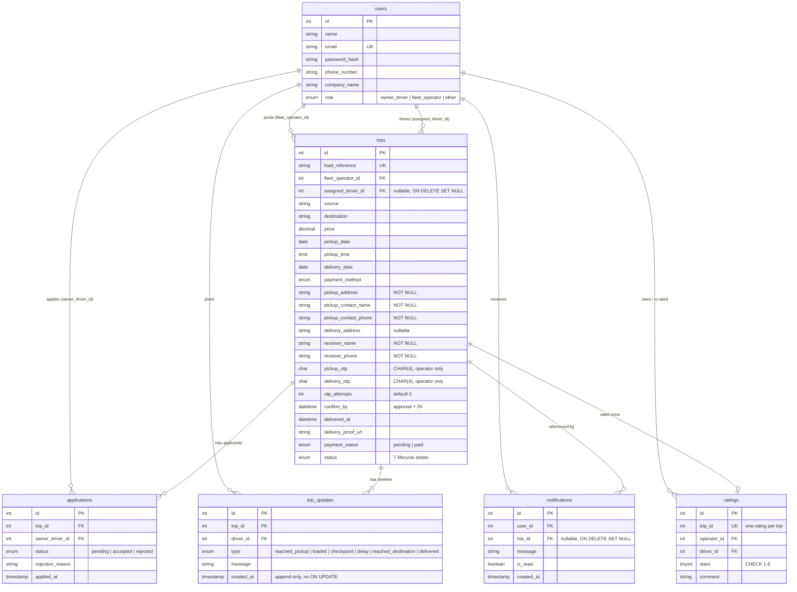
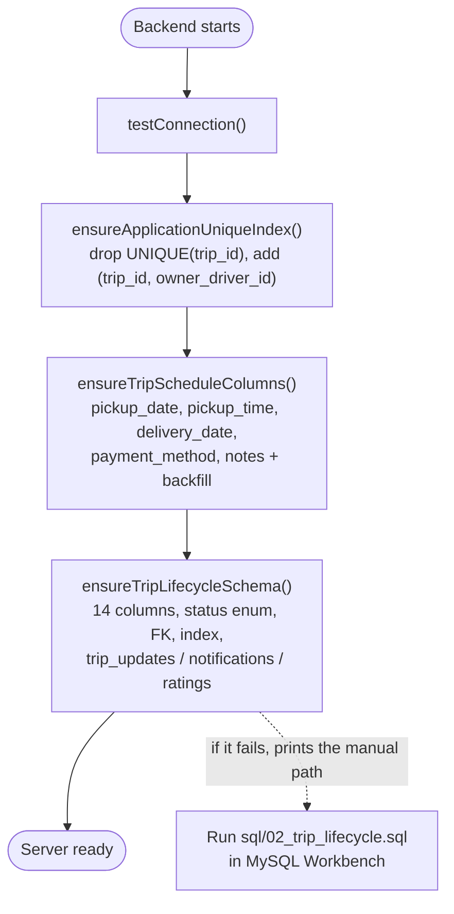

# FleetLink — Architecture & Flow

FleetLink is a logistics platform for India: fleet operators post transport
jobs, drivers apply, and both sides track a trip through a fixed lifecycle with
OTP-gated handovers.

- **Frontend** — React 19 + Vite + Tailwind, port `5173`
- **Public API** — Node + Express, port `5000`, mounts under `/api`
- **Admin API** — separate Express app, port `5001`, mounts under `/api/admin`
- **Database** — MySQL 8, one shared schema

---

## 1. System overview



The admin API runs on its own port with a **different JWT secret**, so a token
minted by the public API cannot be replayed against the admin API.

---

## 2. Roles

| Role | Stored as | Surface | Can do |
|---|---|---|---|
| Driver | `owner_driver` | Driver Dashboard | Browse open trips, apply, confirm assignment, enter OTPs, post milestones, upload delivery proof |
| Operator | `fleet_operator` | Operator Dashboard | Post/edit trips, approve applicants, share OTPs, reassign, cancel, confirm delivery, mark paid, rate driver |
| Admin | separate table | Admin Dashboard | Read-only oversight of users and trips, force status changes |

Roles are enforced server-side by `requireRole(...)` middleware — the UI hides
actions but the API is the boundary.

---

## 3. Trip lifecycle

The status machine lives in one place, `backend/src/utils/tripLifecycle.js`.
Any transition not listed is rejected.



### What each state unlocks

| Status | Addresses & contacts visible to driver? | OTPs visible to |
|---|---|---|
| `open` | — no driver assigned yet | — |
| `assigned` | **No** — locked until confirmation | operator only |
| `confirmed` | Yes | operator only |
| `in_transit` → `delivered` | Yes | operator only |

Addresses are enforced in SQL, not just the UI — `getActiveTripsForDriver()`
`CASE`-gates all six sensitive columns to `NULL` while the status is `assigned`:

```sql
CASE WHEN t.status = 'assigned' THEN NULL ELSE t.pickup_address END AS pickup_address
```

---

## 4. End-to-end trip flow



---

## 5. OTP handovers

Two separate 4-digit codes are generated per trip, and they are always
**different from each other**. The driver is never sent either one — the
operator reads them and passes them along.



Notes:
- The pickup OTP must be entered **before `confirm_by`**, which is set two hours
  after approval. Expiry is checked on the server, not trusted from the client.
- Failed attempts are counted in `otp_attempts`; the 5-attempt lock is a
  database column, not a client-side flag.

---

## 6. Data model



Deliberate choices:
- `applications` has `UNIQUE (trip_id, owner_driver_id)` — many drivers per trip,
  one application per driver. Older databases had `UNIQUE(trip_id)`, which
  silently blocked the second applicant.
- `ratings.trip_id` is `UNIQUE`, making "rate once" a database guarantee rather
  than an application convention.
- `notifications.trip_id` is `ON DELETE SET NULL`, so deleting a trip leaves a
  readable bell entry instead of cascading the notification away.

---

## 7. API surface

### Public API — `:5000`

| Method | Path | Role | Purpose |
|---|---|---|---|
| POST | `/api/auth/register` | public | Create account |
| POST | `/api/auth/login` | public | Log in |
| GET | `/api/auth/me` | any | Current user |
| GET | `/api/trips` | optional | Browse open trips (no contacts) |
| POST | `/api/trips` | operator | Post a trip |
| GET | `/api/trips/my` | operator | Own trips |
| GET | `/api/trips/:id` | optional | Trip detail |
| PUT | `/api/trips/:id` | operator | Edit trip |
| DELETE | `/api/trips/:id` | operator | Delete trip |
| GET | `/api/trips/generate-reference` | operator | Unique load reference |
| GET | `/api/trips/active` | driver | Active trips (addresses gated) |
| GET | `/api/trips/:id/applicants` | operator | Who applied |
| GET | `/api/trips/:id/otp-links` | operator | OTPs + WhatsApp links |
| GET | `/api/trips/:id/timeline` | driver/operator | Milestones |
| GET | `/api/trips/:id/rating` | any | Existing rating |
| POST | `/api/trips/:id/rating` | operator | Rate the driver |
| POST | `/api/trips/:id/reassign` | operator | Reassign after expiry |
| PUT | `/api/trips/:id/confirm` | driver | Confirm assignment |
| POST | `/api/trips/:id/verify-pickup` | driver | Enter pickup OTP |
| POST | `/api/trips/:id/verify-delivery` | driver | Delivery OTP + proof |
| PUT | `/api/trips/:id/status` | operator | Lifecycle transition |
| POST | `/api/trips/:id/updates` | driver | Post a milestone |
| PUT | `/api/trips/:id/confirm-delivery` | operator | Confirm receipt |
| PUT | `/api/trips/:id/payment` | operator | Mark paid |
| POST | `/api/applications` | driver | Apply to a trip |
| GET | `/api/applications/my` | driver | My applications |
| PUT | `/api/applications/:id/accept` | operator | Approve |
| PUT | `/api/applications/:id/reject` | operator | Reject with reason |
| GET | `/api/notifications` | any | Bell list |
| PUT | `/api/notifications/:id/read` | any | Mark one read |
| PUT | `/api/notifications/read-all` | any | Mark all read |

Static route ordering matters: `/my`, `/generate-reference` and `/active` are
declared **before** `/:id`, or `/:id` would swallow them.

### Admin API — `:5001`

| Method | Path | Purpose |
|---|---|---|
| POST | `/api/admin/login` | Admin login (separate secret) |
| GET | `/api/admin/me` | Current admin |
| GET | `/api/admin/overview` | Dashboard counters |
| GET | `/api/admin/operators` · `/operators/:id` | Operator oversight |
| GET | `/api/admin/drivers` · `/drivers/:id` | Driver oversight |
| GET | `/api/admin/trips` · `/trips/:id` | Trip oversight |
| GET | `/api/admin/trips/routes` | Route analytics |
| PUT | `/api/admin/trips/:id/status` | Force a status change |
| GET | `/api/admin/applications` · `/applications/driver-routes` | Application oversight |

---

## 8. Database migrations

MySQL 8 has no `ADD COLUMN IF NOT EXISTS`, so every migration checks
`information_schema` first and is safe to re-run.



Three places describe the same schema, and they are guarded by a test
(`backend/tests/schemaParity.test.js`) so they cannot drift:

1. `backend/schema.sql` — the complete fresh-install shape
2. `backend/sql/02_trip_lifecycle.sql` — the manual migration
3. `ensureTripLifecycleSchema()` in `backend/src/config/db.js` — the same
   migration, applied automatically at boot

The startup migration is idempotent and interrupt-safe, and it only widens
`status` or tightens `NOT NULL` when a column is actually still wrong. A
pre-lifecycle database therefore cannot fail with
`Unknown column 'pickup_address' in 'field list'`.

> `status` is widened to `VARCHAR` **before** `in_progress` is remapped to
> `in_transit` — an ENUM cannot accept a value it does not contain, so remapping
> first would silently truncate the row to `''`.

---

## 9. Tests

```
npm test          # in backend/ and frontend/
```

| Suite | Guards |
|---|---|
| `backend/tests/tripLifecycle.test.js` | Status machine, OTP pairs, timezone round-trip, phone rules, WhatsApp links |
| `backend/tests/schemaParity.test.js` | `schema.sql` ≡ the SQL migration ≡ the startup migration ≡ the model `INSERT` |
| `frontend/tests/tripValidation.test.js` | The Post Trip form's own rules |
| `frontend/tests/validationParity.test.mjs` | Client validator ≡ server `validateTrip()` |
| `frontend/tests/activeTripQuery.test.mjs` | Every field `ActiveTrip.jsx` reads is selected; the six sensitive columns stay `CASE`-gated |

These are plain `node` scripts, not a framework. The things worth protecting
here are **cross-file contracts** — two files that must agree but are compiled
separately — and reading the same source each side runs on checks the contract
more directly than a mocked component tree would.

---

## 10. Notable fixes

| Symptom | Cause | Fix |
|---|---|---|
| `Unknown column 'pickup_address'` | Lifecycle migration never applied | Applied automatically at startup |
| Post Trip button did nothing | Native `required`/`min` validation fired against fields scrolled out of a full-screen modal | `noValidate` + explicit validation, scroll to first error, pinned submit footer |
| Post Trip modal filled the screen | Card had no height cap; centred flex pushed the top above the scroll area | `max-h-[90vh]`, `items-start`, scrollable body, fixed header/footer |
| OTP lock never appeared | `otp_attempts` was dropped when the driver query was rewritten | Restored, with a test that catches any field going missing |
| Wrong date in the confirmation window | Deadline written as UTC, read as local | Written in server-local MySQL time; verified round-trip in UTC+05:30 |
| Proof images 404'd | `/uploads/...` resolved against the Vite origin | `apiAssetUrl()` resolves against the API base |
| Raw timestamps in the UI | MySQL `DATETIME` parsed through `new Date()` | `formatDateTime()` reads the string field by field |
